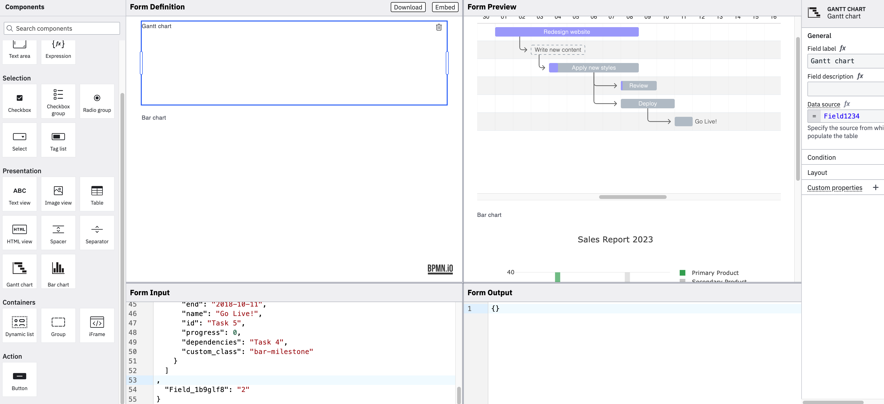

# form-js Custom Components Example

This example uses [form-js](https://github.com/bpmn-io/form-js) to implement custom form components.



## About

In this example we extend form-js with a custom component that allows users to select a number from a range. To achieve that we will walk through the following steps:

* Add a custom form component renderer

### Add a custom form component renderer

The first step is to add a custom form component renderer. 

The renderer is responsible for rendering the component in the form editor and the form preview. It also handles the interaction with the component, e.g. when the value changes or validation.

We create the [`GanttRenderer`](./app/extension/render/Gantt.js) which defines a couple of things

* a [preact](https://preactjs.com/) component that renders the component in the form editor and preview by re-using existing components like `Label`, `Errors` and `Description`

```js
import classNames from 'classnames';

/*
 * Import components and utilities from our extension API. Warning: for demo experiments only.
 */
import {
  Errors,
  FormContext,
  Default,
  Description,
  Label,
  Table
} from '@bpmn-io/form-js';

import {
  html,
  useContext
} from 'diagram-js/lib/ui';

import './styles.css';

import GanttIcon from './gantt.svg';

export const ganttType = 'gantt';

/*
 * This is the rendering part of the custom field. We use `htm` to
 * to render our components without the need of extra JSX transpilation.
 */
export function GanttRenderer(props) {

  const {
    errors = [],
    field
  } = props;

  const {
    description,
    id,
    label
  } = field;

  const { formId } = useContext(FormContext);

  const errorMessageId = errors.length === 0 ? undefined : `${prefixId(id, formId)}-error-message`;

  setTimeout(setGantt, 50, props, prefixId(id, formId));

  function setGantt(props, divSuffix) {

    let fieldName = props.field.dataSource.substring(1);
    let myMap = new Map(Object.entries(props.value));
    let tasks = myMap.get(fieldName);

    let divId = '#gantt-' + divSuffix;

    console.log('divId is ' + divId);

    let gantt = new Gantt(divId, tasks, {
      header_height: 50,
      column_width: 30,
      step: 24,
      view_modes: [ "Quarter Day", "Half Day", "Day", "Week", "Month" ],
      bar_height: 20,
      bar_corner_radius: 3,
      arrow_curve: 5,
      padding: 18,
      view_mode: "Day",
      date_format: "YYYY-MM-DD",
      language: "en", // or 'es', 'it', 'ru', 'ptBr', 'fr', 'tr', 'zh', 'de', 'hu'
      custom_popup_html: null,
    });
  }

  /* We use `htm` to
  * to render our components without the need of extra JSX transpilation.

   */

  return html`
      <head>
          <script type="text/javascript" src="https://cdnjs.cloudflare.com/ajax/libs/frappe-gantt/0.6.1/frappe-gantt.min.js"></script>
          <link rel="stylesheet" href="https://cdnjs.cloudflare.com/ajax/libs/frappe-gantt/0.6.1/frappe-gantt.css"></script>

          <script type="text/javascript">
              ${setTimeout}
          </script>
      </head>
      <body>
      <${ Label } htmlFor=${ prefixId(id) } label=${ label } />
      <div id="gantt-${prefixId(id, formId)}"></div>
      </body>`;
}
```

* a component `config` that extends the base `Table` configuration and adds customizations as the icon, a custom label and the default properties panel entries to show

```js


/*
 * This is the configuration part of the custom field. It defines
 * the schema type, UI label and icon, palette group, properties panel entries
 * and much more.
 */
GanttRenderer.config = {

  /* we can extend the default configuration of existing fields */
  ...Table.config,
  type: ganttType,
  label: 'Gantt chart',
  group: 'presentation',
  iconUrl: `data:image/svg+xml,${ encodeURIComponent(GanttIcon) }`,
  propertiesPanelEntries: [
    'field',
    'label',
    'description',
    'dataSource'
  ]
};
```

### Register the custom renderer

We use the `formFields` service to register our custom renderer for the `range` type.

```js
class CustomFormFields {
  constructor(formFields) {
    formFields.register('range', GanttRenderer);
  }
}


export default {
  __init__: [ 'rangeField' ],
  rangeField: [ 'type', CustomFormFields ]
};
```

### Add custom styles

We define custom styles for the range component by adding a simple CSS file [`styles.css`](./app/extension/render/styles.css). For the example we import the styles directly to the component as we have a bundler ([webpack](https://webpack.js.org/)) in place that adds the styles to the application.

```css
.range-group {
  width: 100%;
  display: flex;
  flex-direction: row;
}

.range-group input {
  width: 100%;
}
.range-group .range-value {
  margin-left: 4px;
}
```

### Add custom properties panel entries

Note: Not used in this example. Left in for documentation purposes

With `config.propertiesPanelEntries` we define the default properties panel entries to show for the component. We can also add custom entries to the properties panel.

We add a [`CustomPropertiesProvider`](./app/extension/properties-panel/CustomPropertiesProvider.js) that allows users to specify the min, max and step of the range component. We place the group right after the general group.

```js
export class CustomPropertiesProvider {
  constructor(propertiesPanel) {
    propertiesPanel.registerProvider(this, 500);
  }

  getGroups(field, editField) {

    ...
    return (groups) => {

      if (field.type !== 'range') {
        return groups;
      }

      const generalIdx = findGroupIdx(groups, 'general');

      groups.splice(generalIdx + 1, 0, {
        id: 'range',
        label: 'Range',
        entries: RangeEntries(field, editField)
      });

      return groups;
    };
  }
}
```

The [`RangeEntries`](./app/extension/properties-panel/CustomPropertiesProvider.js) function returns the entries to show for the range component. Check out the full provider to gather more insights.

```js
function RangeEntries(field, editField) {

  const onChange = (key) => {
    return (value) => {
      const range = get(field, [ 'range' ], {});

      editField(field, [ 'range' ], set(range, [ key ], value));
    };
  };

  const getValue = (key) => {
    return () => {
      return get(field, [ 'range', key ]);
    };
  };

  return [

    {
      id: 'range-min',
      component: Min,
      getValue,
      field,
      isEdited: isNumberFieldEntryEdited,
      onChange
    },
    {
      id: 'range-max',
      component: Max,
      getValue,
      field,
      isEdited: isNumberFieldEntryEdited,
      onChange
    },
    {
      id: 'range-step',
      component: Step,
      getValue,
      field,
      isEdited: isNumberFieldEntryEdited,
      onChange
    }
  ];
}
```

### Plugging Everything together

To embed the customizations into the form-js we need to plug everything together. We do that by including the custom renderer into both editor and preview via `additionalModules` and registering the custom properties provider to the editor via `editorAdditionalModules`.

```js
import { FormPlayground } from '@bpmn-io/form-js';

import RenderExtension from './extension/render';
import PropertiesPanelExtension from './extension/propertiesPanel';

import '@bpmn-io/form-js/dist/assets/form-js.css';
import '@bpmn-io/form-js/dist/assets/form-js-editor.css';
import '@bpmn-io/form-js/dist/assets/form-js-playground.css';

new FormPlayground({
  container,
  schema,
  data,
  additionalModules: [
    RenderExtension
  ],
  editorAdditionalModules: [
    PropertiesPanelExtension
  ]
});
```

## Building

You need a [NodeJS](http://nodejs.org) development stack with [npm](https://npmjs.org) installed to build the project.

To install all project dependencies execute

```
npm install
```

Spin up a development setup by executing

```
npm run dev
```